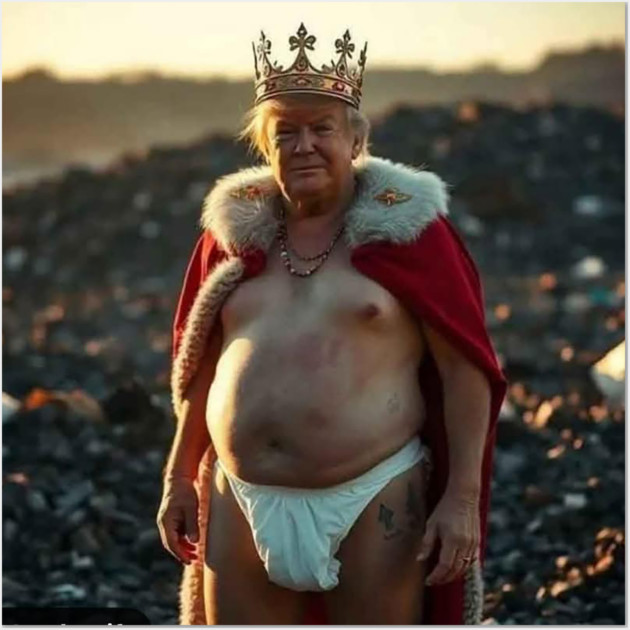

## 👑 King Marmalade

  

<h1 align="center">"Oogachaka Baby"</h1>

  by 
  <strong>Raul Bras</strong>

---

## Idea

The ["Dancing Baby"](https://en.wikipedia.org/wiki/Dancing_baby) video is one of the first internet memes that went viral in the 1990s. I felt it was the perfect idea to use for the first video in my amateur filmmaking career.

## Technologies Used

| Technology | Purpose |
|------------|---------|
| **Google Antigravity IDE** | Text editor and project management |
| **Google Flow** | Image and video generation |
| **OpenAI ChatGPT** | Prompts review |
| **GitHub** | Repository hosting |

## License

This project is licensed under the [Creative Commons Attribution-NonCommercial-ShareAlike 4.0 International](https://creativecommons.org/licenses/by-nc-sa/4.0/) License.

See [LICENSE](LICENSE) for more details.

---

🇧🇷 *Made in [Brazil](https://en.wikipedia.org/wiki/Brazil), in the Land of [Oz (SP)](https://en.wikipedia.org/wiki/Osasco), with [🌭 🍕](https://www.google.com/search?q=Pizza+Dog%C3%A3o+Osasco) and [Google AI](https://labs.google/fx/tools/flow) 🤖.*
